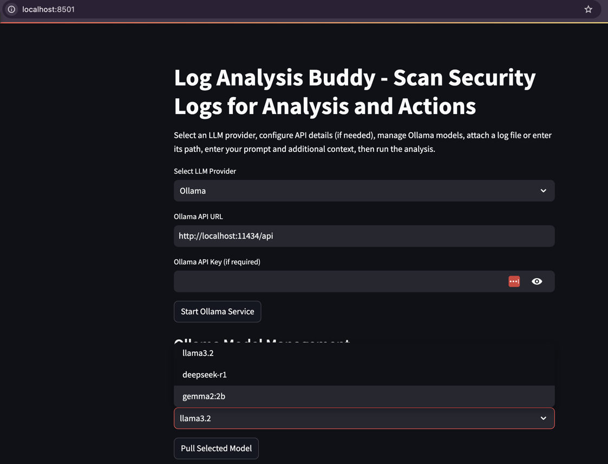
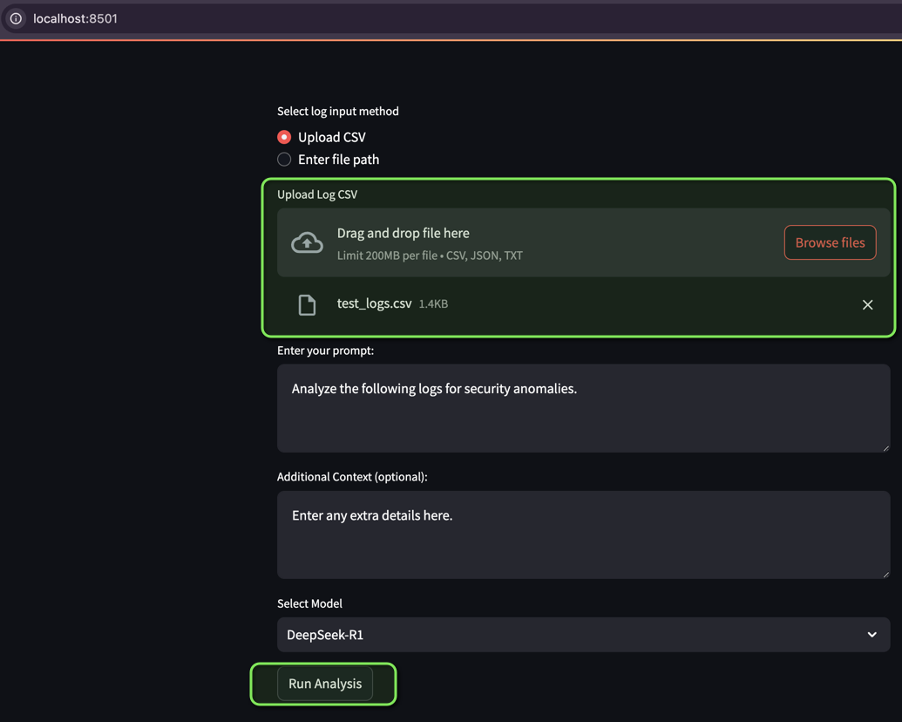
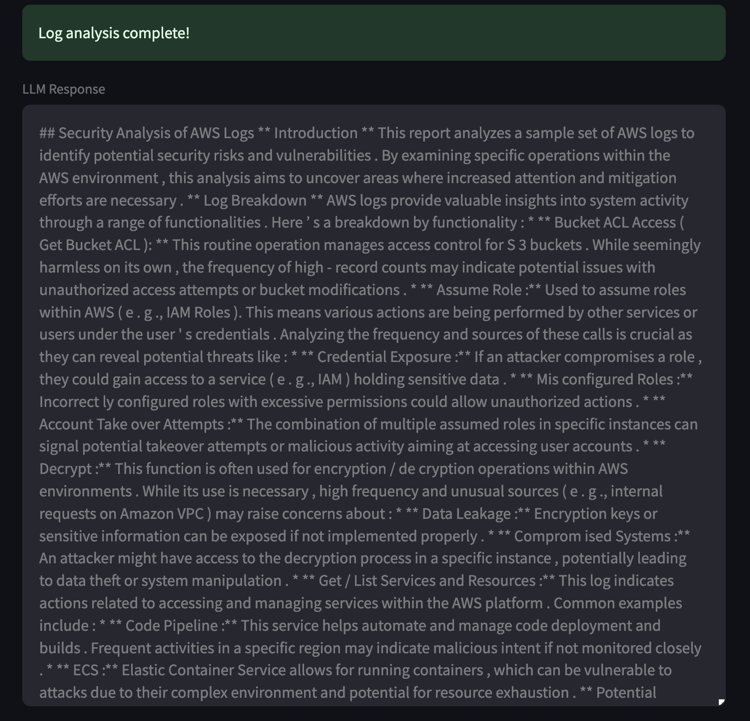

[](https://twitter.com/dozercat31)


# Log Analysis Buddy - AI Powered Log Analysis Helper
The Log Analysis Buddy is an AI powered log analysis helper that can be used to help analysts perform log analysis. The Log analysis Buddy uses LLMs to receive log input (in .csv, or comma delimited, format) from an incident responder, to perform additional analysis for the responder. This analysis can be used to augment the responder's investigation, to provide thourogh results for reporting.

## Disclaimer
**2025-02-28: This project is currently in development and is a proof of concept. Additionally, you are responsible for any data that you provide to public LLMs via this project. This includes any logs that are provided, API keys, and any data via the context prompt.**

## Prerequisites
The following are prerequisites for using the Log Analysis Buddy:
- The ability to run Docker containers
- Log files in .csv (comma delimited) format, preferably
- An internet connection to download the initial models in the Docker
- The ability to run a local virtual environment (using venv)

## How to Use
Steps to use the Log Analysis Buddy:
1. After downloading the code, run the following command within the same directory as the code to build the Docker container:
```
docker build -t log_analysis_buddy .
```
If you're using an `apt` based environment, and you want to avoid mixing package installs, use a virtual environment with `venv` instead.
2. Run the Docker container
```
docker run -it -p 8501:8501 log_analysis_buddy
```
3. Access the container via the browser at `http://localhost:8501` to use the Log Analysis Buddy.
4. Select a model to use for the log analysis (available models are llama3.2, gamma2:2b and deepseek-r1)

5. Upload the log file you want to analyze and select "Run Analysis".



## Example Output

## Contributions & Feedback
For any contributions, feel free to create a [GitHub Pull Request](https://github.com/hackersifu/log_analysis_buddy/pulls). Additionally, you can use the Issues section to report bugs or submit feedback.

## License
This project is licensed under the Apache 2.0 licensing terms. Please see the LICENSE file for more information.
